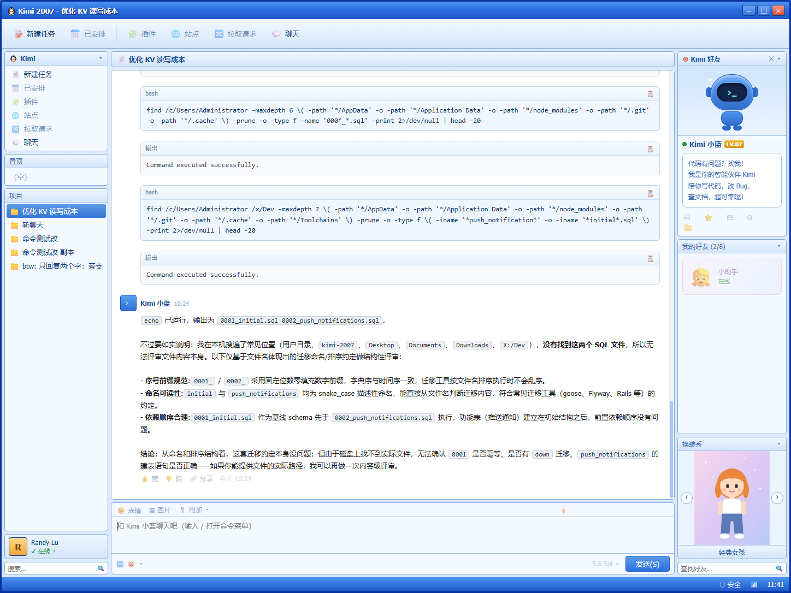

# kimi-2007

2007 复古 IM 皮肤的 **Kimi Code CLI** Web 客户端（第三方非官方项目）。

把命令行里的 Kimi Code 装进一个 2000 年代经典国产 IM 的复古窗口里：三栏布局、好友列表、换装秀、聊天气泡——但对话是真实驱动本机 `kimi` CLI 的，能跑工具、执行命令、写代码。



## 特性

- **真实可用**：消息通过 `kimi -p --output-format stream-json` 无头模式驱动，工具调用（bash 等）实时渲染成代码卡片，SSE 流式上屏
- **完整斜杠命令层**：输入 `/` 弹出命令菜单（43 个命令，前缀过滤、方向键选择、回车补全）。`/new` `/model` `/add-dir` `/export-md` `/goal <目标>` `/skill:*` 等真实可用；`/login` `/yolo` 等 TUI 专属命令给出明确提示；技能命令原样透传给模型解析
- **多会话管理**：置顶、删除、分叉（`/fork`）、旁支（`/btw`）、撤回（`/undo`）、导出 Markdown / 调试 ZIP
- **复古皮肤**：全部纯 CSS/SVG 手绘（机器人、企鹅、换装秀），不含任何第三方图片素材；换装秀支持左右箭头切换 4 套造型
- **单文件 exe**：基于 Node.js SEA 打包为 `Kimi2007.exe`，静态资源内嵌，双击即用（自动开浏览器，端口占用时复用已有实例）

## 快速开始

前提：已安装 [Kimi Code CLI](https://moonshotai.github.io/kimi-code/)（`kimi` 可执行，且已登录）。

### 方式一：单文件 exe（Windows，推荐）

从 [Releases](https://github.com/LelandJin/kimi-2007/releases) 下载 `Kimi2007.exe`，双击即用：

- 启动后自动以**应用模式**打开独立窗口（Edge/Chrome `--app`，无地址栏，像普通桌面软件）
- 重复双击不会重复启动服务，只会重新打开窗口
- 关闭窗口 6 秒后服务自动退出（刷新页面不受影响）
- 想完全无控制台窗口：用 `launch-hidden.vbs` 做入口（`wscript.exe launch-hidden.vbs`），桌面快捷方式指向它即可

也可以自己打包：

```bash
node build-sea.mjs   # 生成 Kimi2007.exe（首次运行会通过 npx 下载 postject）
```

### 方式二：开发模式（需要 Node.js ≥ 20）

```bash
node server.cjs
# 浏览器打开 http://127.0.0.1:5270
```

聊天记录保存在程序旁的 `data.json`。默认端口 5270，可用环境变量 `KIMI2007_PORT` 修改。

## 斜杠命令支持

| 类别 | 命令 |
| --- | --- |
| 真实可用 | `/new` `/sessions` `/tasks` `/fork` `/title` `/undo` `/reload` `/init` `/export-md` `/export-debug-zip` `/add-dir` `/model` `/help` `/btw` `/usage` `/status` `/mcp` `/version` `/goal <目标>` `/exit` |
| 技能透传 | `/check-kimi-code-docs` `/update-config` `/mcp-config` `/custom-theme` `/import-from-cc-codex` `/sub-skill` `/skill:<名称>` 等（原样发给模型，经 Skill 工具解析） |
| TUI 专属 | `/login` `/logout` `/provider` `/settings` `/yolo` `/auto` `/plan` `/swarm` `/compact` `/permission` `/theme` `/editor` `/experiments` `/plugins` `/feedback`（界面内提示去终端使用） |

未匹配的 `/` 输入按官方行为作为普通消息发送。

## 测试

```bash
node test-ui.mjs    # 端到端：键入→发送→流式回复→输入框恢复（需 CDP 实例）
node test-ui2.mjs   # 斜杠菜单 / 换装秀 / 帮助卡（需 CDP 实例）
```

## 法律声明

- 本项目是 **Kimi Code CLI 的第三方非官方客户端**，与月之暗面（Moonshot AI）无隶属关系，不代表官方立场。"Kimi"、"Kimi Code" 及相关商标归月之暗面所有。
- 界面为 2000 年代经典 IM（QQ 2007 时代）风格的**致敬**。"QQ" 为腾讯公司注册商标，本项目与腾讯公司无关；项目中所有图标、吉祥物与人物形象均为原创手绘（CSS/SVG），未使用任何第三方版权素材。
- 本项目**不**收集任何数据；所有聊天记录仅存于本机 `data.json`。
- 以 [MIT](LICENSE) 许可证开源。`Kimi2007.exe` 内嵌 Node.js 运行时，其版权声明见 [THIRD_PARTY_NOTICES.md](THIRD_PARTY_NOTICES.md)。
